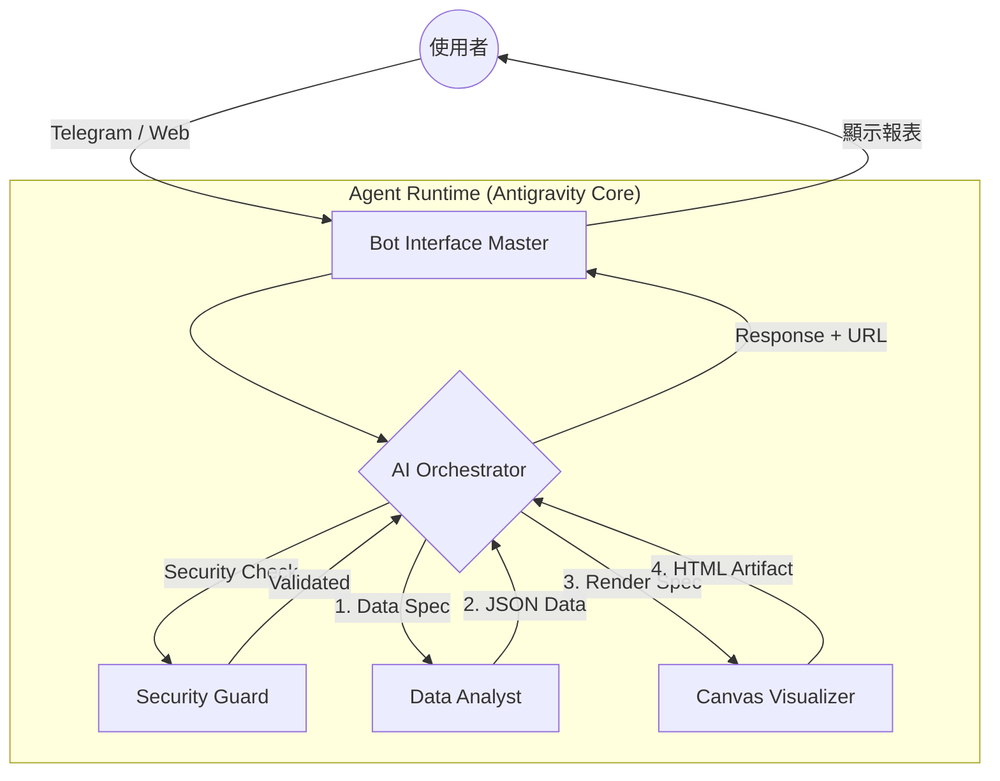

# 🤖 AI Agent 系統架構規範 (AI Agent Architecture)

**目標：** 定義 AI Agent 的核心目錄結構、技能組架構與系統邏輯流，確保模組化與安全性。

---

## 1. Antigravity 目錄結構規範 (Directory Structure)

在 Antigravity 中，`.agent` 資料夾採用的標準結構旨在分離「約束 (Rules)」、「能力 (Skills)」與「流程 (Workflows)」。

* **`rules/` (系統護欄)**：定義全域編碼風格、資安規範。**Passive (被動)** 觸發，Agent 啟動時自動載入，全程監控行為。
* **`skills/` (原子能力)**：獨立的功能模組（如：SQL 查詢、圖表渲染）。**On-demand (隨選)** 觸發，Agent 根據需求自動判斷並調用。
* **`workflows/` (標準 SOP)**：多步驟的序列指令（如：`/deploy`）。**Active (主動)** 觸發，使用者輸入特定指令時執行。
* **`context/` (知識庫)**：存放專案專屬技術文件、架構說明或歷史決策。**Semantic (語意)** 觸發，Agent 進行檢索 (RAG) 時使用。

---

## 2. AI Agent 技能組架構 (Agent Skills Architecture)

AI Agent 的技能組具備高度的模組化與封裝性，核心目錄位於 `.agent/skills/`：

* **`ai-orchestrator/`**：任務編排大腦。包含 `SKILL.md` (決策邏輯) 與 `scripts/` (路由邏輯)。
* **`ai-data-analyst/`**：數據分析專家 (Python 3.12)。包含 `SKILL.md` (Spec-First 規範) 與 `scripts/` (分析引擎)。
* **`canvas-visualizer/`**：報表渲染專家 (React/AntV)。包含 `SKILL.md` (渲染參數) 與 `resources/` (HTML 模板)。
* **`bot-interface-master/`**：Telegram/Web 交互。包含 `SKILL.md` (組件定義) 與 `scripts/` (Webhook 處理)。
* **`ai-security-guard/`**：安全與權限控管。包含 `SKILL.md` (脫敏規則) 與 `scripts/` (PII Masking)。

---

## 3. 系統核心邏輯流 (Core Logic Flow)

整合 **Security** 與 **Spec-Coding** 的完整鏈條，從使用者輸入到報表產出。

### 邏輯架構圖 (Mermaid)

### 層級職責說明

* **Interface Layer (交互層)**：處理外部訊息，維護 Session 狀態。
* **Orchestration Layer (編排層)**：系統大腦，負責意圖解析與 Skill 調度。
* **Capability Layer (能力層)**：包含 `Analyst` 與 `Visualizer`，負責純粹的數據運算與 UI 產出。
* **Security Layer (安全層)**：攔截所有 I/O，進行權限驗證與敏感數據去識別化。

---
*最後更新日期: 2026-03-10*