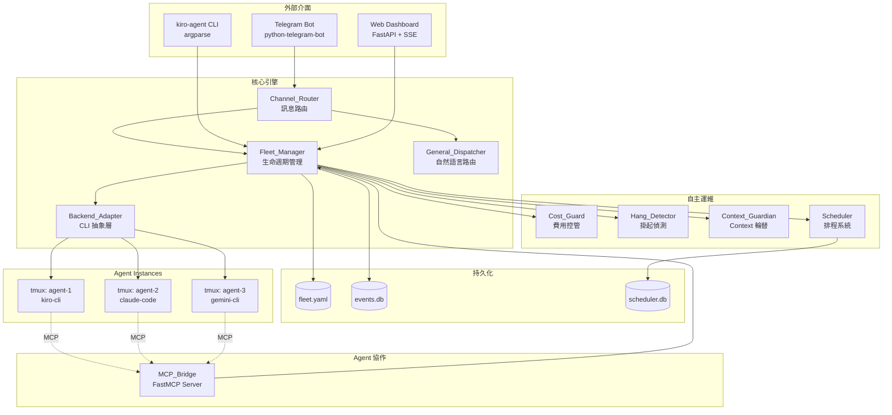
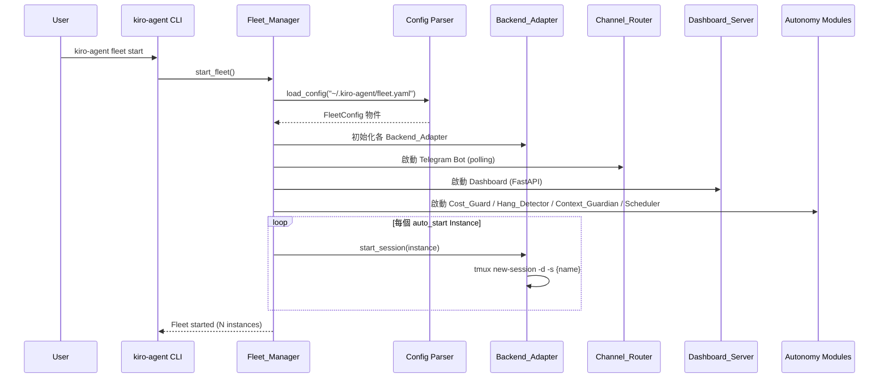
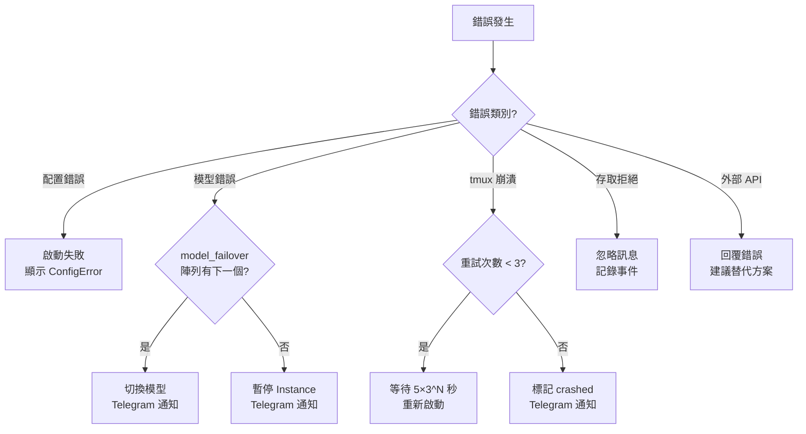

# Design Document — kiro-agent

## Overview

kiro-agent 是一個以 Python 建構的多 Agent 艦隊管理系統，將 Telegram 轉變為 AI 編碼 Agent 的指揮中心。系統以 Kiro CLI 為主要後端，支援多種 AI CLI 後端混用（Claude Code、Gemini CLI 等）。每個 Telegram Forum Topic 對應一個獨立的 Agent Session，Agent 之間透過 MCP Tool 進行 P2P 協作。

### 設計目標

1. **宣告式艦隊管理**：透過 `fleet.yaml` 定義所有 Instance、Team 與預設值
2. **後端無關抽象**：統一的 Backend_Adapter 介面，隔離不同 AI CLI 的差異
3. **自主運維**：費用控管、掛起偵測、Context 輪替讓艦隊可無人值守運行
4. **即時監控**：Telegram 通知 + Web Dashboard SSE 雙通道即時狀態推送
5. **安全優先**：所有敏感資訊從 `.env` 讀取，Telegram User ID 白名單存取控制

### 技術選型

| 元件 | 技術 | 理由 |
|------|------|------|
| 語言 | Python 3.12 | 專案標準，`py` 啟動器 |
| Telegram | python-telegram-bot | 專案已使用，支援 Forum Topic |
| Web | FastAPI + uvicorn | 專案已使用，原生 SSE 支援 |
| 資料庫 | SQLite | 輕量持久化，無需額外服務 |
| MCP | FastMCP (mcp 套件) | 專案已使用，標準 MCP 協議 |
| LLM | google-genai | 專案標準 Gemini 套件 |
| Session 隔離 | tmux | 每個 Instance 獨立 terminal session |
| 配置格式 | YAML (PyYAML) | 人類可讀的宣告式配置 |
| 排程 | croniter | 輕量 cron 表達式解析 |
| 語音轉錄 | Groq Whisper API (httpx) | 高速語音轉文字 |

---

## Architecture

### 系統架構圖



### 模組結構

```
~/.kiro-agent/                    # 執行時資料目錄
├── fleet.yaml                    # 艦隊配置
├── .env                          # 敏感資訊（Bot Token、API Key）
├── events.db                     # 事件日誌 SQLite
├── scheduler.db                  # 排程 SQLite
└── instances/
    └── <name>/
        ├── statusline.json       # CLI 狀態（context 使用率等）
        ├── rotation_snapshot.md  # 最近一次 Context 輪替快照
        └── chat_history.jsonl    # 對話記錄（供匯出用）

kiro-agent/                       # 原始碼（pip install -e .）
├── __init__.py
├── __main__.py                   # CLI 入口 (kiro-agent)
├── config.py                     # Fleet_Config 載入與驗證
├── fleet_manager.py              # 艦隊管理核心
├── channel_router.py             # Telegram 訊息路由
├── general_dispatcher.py         # General Topic 自然語言路由
├── backend_adapter.py            # AI CLI 後端抽象層
├── mcp_bridge.py                 # MCP Tool 橋接（FastMCP Server）
├── cost_guard.py                 # 費用控管
├── hang_detector.py              # 掛起偵測
├── context_guardian.py           # Context 輪替
├── scheduler.py                  # 排程系統
├── dashboard.py                  # Web Dashboard（FastAPI）
├── event_logger.py               # 事件日誌
├── voice_transcriber.py          # 語音轉錄（Groq Whisper）
├── html_exporter.py              # HTML 對話匯出
├── model_failover.py             # 模型故障轉移
├── models.py                     # 資料模型（dataclass）
└── db.py                         # SQLite 工具函式
```

### 啟動流程



---

## Components and Interfaces

### 1. config.py — Fleet_Config 載入與驗證

```python
from dataclasses import dataclass, field
from pathlib import Path
from typing import Any

@dataclass
class InstanceConfig:
    name: str
    project: str                          # project_roots 中的 key
    backend: str = "kiro-cli"
    model: str = "auto"
    description: str = ""
    auto_start: bool = False
    model_failover: list[str] = field(default_factory=list)
    mcp_tools: list[str] = field(default_factory=list)

@dataclass
class TeamConfig:
    name: str
    members: list[str]                    # Instance 名稱清單
    description: str = ""

@dataclass
class CostGuardConfig:
    daily_limit_usd: float = 10.0
    warn_at_percentage: float = 80.0
    timezone: str = "Asia/Taipei"

@dataclass
class HangDetectorConfig:
    enabled: bool = True
    timeout_minutes: int = 30

@dataclass
class AccessConfig:
    mode: str = "locked"                  # locked | open
    allowed_users: list[int] = field(default_factory=list)

@dataclass
class FleetConfig:
    project_roots: dict[str, str]         # name -> absolute path
    channel: dict[str, Any]               # bot_token_env, group_id, general_topic_id
    defaults: dict[str, str]              # backend, model
    instances: list[InstanceConfig]
    teams: list[TeamConfig] = field(default_factory=list)
    cost_guard: CostGuardConfig = field(default_factory=CostGuardConfig)
    hang_detector: HangDetectorConfig = field(default_factory=HangDetectorConfig)
    access: AccessConfig = field(default_factory=AccessConfig)
    health_port: int = 8470

def load_config(path: Path) -> FleetConfig:
    """載入並驗證 fleet.yaml，回傳 FleetConfig 或 raise ConfigError"""
    ...

def dump_config(config: FleetConfig) -> str:
    """將 FleetConfig 序列化為 YAML 字串"""
    ...

class ConfigError(Exception):
    """配置驗證錯誤，包含欄位名稱與問題描述"""
    def __init__(self, field: str, message: str): ...
```

### 2. backend_adapter.py — AI CLI 後端抽象層

```python
from abc import ABC, abstractmethod
from models import InstanceState

class BackendAdapter(ABC):
    """所有 AI CLI 後端的統一介面"""

    @abstractmethod
    async def start_session(self, instance: InstanceConfig, work_dir: Path) -> None:
        """在 tmux session 中啟動 CLI"""
        ...

    @abstractmethod
    async def send_message(self, instance_name: str, message: str) -> None:
        """透過 tmux send-keys 傳送訊息到 CLI"""
        ...

    @abstractmethod
    async def stop_session(self, instance_name: str) -> None:
        """優雅終止 tmux session"""
        ...

    @abstractmethod
    async def get_status(self, instance_name: str) -> InstanceState:
        """取得 Instance 狀態（running/stopped/hung）"""
        ...

class KiroCliAdapter(BackendAdapter):
    """Kiro CLI 後端 — 支援 steering、skills、fleet-context.md 注入"""
    supported_models = ["auto", "claude-sonnet-4.5", "claude-sonnet-4", "claude-haiku-4.5"]

    async def start_session(self, instance: InstanceConfig, work_dir: Path) -> None:
        # 1. 檢查 .kiro/steering/ 存在
        # 2. 寫入 fleet-context.md
        # 3. tmux new-session -d -s {name} -c {work_dir}
        # 4. tmux send-keys "kiro-cli --model {model}" Enter
        ...

class ClaudeCodeAdapter(BackendAdapter): ...
class GeminiCliAdapter(BackendAdapter): ...
class CodexAdapter(BackendAdapter): ...
class OpenCodeAdapter(BackendAdapter): ...

BACKEND_REGISTRY: dict[str, type[BackendAdapter]] = {
    "kiro-cli": KiroCliAdapter,
    "claude-code": ClaudeCodeAdapter,
    "gemini-cli": GeminiCliAdapter,
    "codex": CodexAdapter,
    "opencode": OpenCodeAdapter,
}

def get_adapter(backend_name: str) -> BackendAdapter:
    """根據名稱取得 BackendAdapter 實例，不存在則 raise BackendError"""
    ...
```

### 3. channel_router.py — Telegram 訊息路由

```python
from telegram import Update
from telegram.ext import Application, MessageHandler, CallbackQueryHandler

class ChannelRouter:
    """Telegram Forum Topic 訊息路由器"""

    def __init__(self, fleet_manager: FleetManager, config: FleetConfig):
        self.fleet_manager = fleet_manager
        self.config = config
        self.topic_instance_map: dict[int, str] = {}  # topic_id -> instance_name

    async def start(self) -> None:
        """啟動 Telegram Bot polling"""
        ...

    async def on_message(self, update: Update, context) -> None:
        """
        訊息處理主流程：
        1. 驗證 user_id 在 allowed_users
        2. 若為語音訊息 → voice_transcriber 轉錄
        3. 若為 General Topic → general_dispatcher 路由
        4. 否則 → 根據 topic_id 找到 instance → send_message
        """
        ...

    async def on_callback_query(self, update: Update, context) -> None:
        """處理 inline button 回調（Allow/Deny、重啟/繼續等待/強制停止）"""
        ...

    async def send_to_topic(self, topic_id: int, text: str) -> None:
        """發送訊息到指定 Forum Topic，超過 4096 字元自動分割"""
        ...

    async def create_topic(self, instance_name: str) -> int:
        """在 Telegram Group 中建立新的 Forum Topic，回傳 topic_id"""
        ...
```

### 4. general_dispatcher.py — 自然語言路由

```python
class GeneralDispatcher:
    """General Topic 自然語言路由 — 使用 Gemini 分析訊息意圖"""

    def __init__(self, fleet_manager: FleetManager, llm_provider):
        self.fleet_manager = fleet_manager
        self.llm = llm_provider

    async def dispatch(self, user_message: str) -> DispatchResult:
        """
        分析使用者訊息，識別目標 Instance 或 Team。
        回傳 DispatchResult(target, confidence, explanation)
        """
        ...

    def _build_routing_prompt(self, message: str, instances: list[InstanceConfig]) -> str:
        """建構路由 prompt，包含所有 Instance 的名稱與描述"""
        ...

@dataclass
class DispatchResult:
    target: str | None          # instance_name 或 team_name
    target_type: str            # "instance" | "team" | "unknown"
    confidence: float           # 0.0 ~ 1.0
    explanation: str            # 路由理由（顯示在 General Topic）
```

### 5. mcp_bridge.py — Agent 間 MCP 協作

```python
from mcp.server.fastmcp import FastMCP

mcp = FastMCP("kiro-agent-bridge")

@mcp.tool()
async def list_instances() -> str:
    """列出所有 Instance 的名稱、狀態、描述與後端類型"""
    ...

@mcp.tool()
async def send_to_instance(target: str, message: str) -> str:
    """透過 IPC 將訊息傳送到目標 Instance 的 tmux Session"""
    ...

@mcp.tool()
async def request_information(target: str, question: str) -> str:
    """向目標 Instance 請求資訊"""
    ...

@mcp.tool()
async def delegate_task(target: str, task: str, context: str = "") -> str:
    """委派任務到目標 Instance（若未啟動則自動喚醒）"""
    ...

@mcp.tool()
async def report_result(requester: str, result: str) -> str:
    """將任務結果回傳給委派者"""
    ...

@mcp.tool()
async def create_team(name: str, members: list[str], description: str = "") -> str:
    """建立新的 Team"""
    ...

@mcp.tool()
async def broadcast(team: str, message: str) -> str:
    """廣播訊息到 Team 的所有成員 Instance"""
    ...
```

### 6. 自主運維模組

```python
# cost_guard.py
class CostGuard:
    """費用控管 — 追蹤 API 使用費用，達上限自動暫停"""

    async def record_cost(self, instance_name: str, amount_usd: float) -> None: ...
    async def check_limits(self) -> list[CostAlert]: ...
    async def reset_daily(self) -> None: ...
    def get_daily_cost(self, instance_name: str) -> float: ...

# hang_detector.py
class HangDetector:
    """掛起偵測 — 每 60 秒檢查 Instance 活動狀態"""

    async def check_all(self) -> list[HangAlert]: ...
    def update_activity(self, instance_name: str) -> None: ...

# context_guardian.py
class ContextGuardian:
    """Context 輪替 — 監控 context 使用率，超過 80% 自動輪替"""

    async def check_all(self) -> list[RotationEvent]: ...
    async def rotate(self, instance_name: str) -> RotationSnapshot: ...
    def _read_statusline(self, instance_name: str) -> dict | None: ...

# scheduler.py
class Scheduler:
    """排程系統 — cron 表達式觸發定時任務，SQLite 持久化"""

    async def create_schedule(self, cron: str, message: str, target: str) -> int: ...
    async def delete_schedule(self, schedule_id: int) -> bool: ...
    async def list_schedules(self) -> list[ScheduleEntry]: ...
    async def toggle_schedule(self, schedule_id: int) -> bool: ...
    async def tick(self) -> list[TriggeredSchedule]: ...
```

### 7. dashboard.py — Web Dashboard

```python
from fastapi import FastAPI, Request
from fastapi.responses import StreamingResponse
import asyncio

app = FastAPI(title="kiro-agent Dashboard")

@app.get("/api/instances")
async def get_instances() -> list[dict]:
    """回傳所有 Instance 的即時狀態"""
    ...

@app.get("/api/events")
async def get_events(limit: int = 50) -> list[dict]:
    """回傳最近的事件日誌"""
    ...

@app.get("/sse")
async def sse_stream(request: Request) -> StreamingResponse:
    """SSE 即時狀態推送"""
    async def event_generator():
        while True:
            if await request.is_disconnected():
                break
            event = await event_queue.get()
            yield f"data: {json.dumps(event)}\n\n"
    return StreamingResponse(event_generator(), media_type="text/event-stream")
```

### 8. 輔助模組

```python
# voice_transcriber.py
async def transcribe_voice(audio_bytes: bytes) -> str:
    """透過 Groq Whisper API 轉錄語音，回傳文字"""
    ...

# html_exporter.py
def export_chat_html(instance_name: str, messages: list[dict]) -> str:
    """將對話記錄匯出為自包含 HTML（內嵌 CSS + JS）"""
    ...

# model_failover.py
class ModelFailover:
    """模型故障轉移 — 依序嘗試 failover 陣列中的模型"""

    async def execute_with_failover(
        self, instance: InstanceConfig, operation: Callable
    ) -> Any:
        """嘗試主模型，失敗則依序切換備用模型"""
        ...

# event_logger.py
class EventLogger:
    """事件日誌 — 寫入 events.db，自動清理 30 天以上記錄"""

    async def log(self, event_type: str, instance_name: str, data: dict) -> None: ...
    async def query(self, event_type: str = None, limit: int = 50) -> list[dict]: ...
    async def cleanup(self, days: int = 30) -> int: ...
```

---

## Data Models

### fleet.yaml 結構

```yaml
project_roots:
  my-app: /home/user/projects/my-app
  my-lib: /home/user/projects/my-lib

channel:
  bot_token_env: TELEGRAM_BOT_TOKEN     # 引用 .env 中的變數名
  group_id: -1001234567890
  general_topic_id: 1

defaults:
  backend: kiro-cli
  model: auto

instances:
  - name: app-dev
    project: my-app
    backend: kiro-cli
    model: claude-sonnet-4
    description: "主應用開發 Agent"
    auto_start: true
    model_failover:
      - claude-sonnet-4
      - claude-haiku-4.5
    mcp_tools:
      - list_instances
      - delegate_task

  - name: lib-dev
    project: my-lib
    description: "函式庫開發 Agent"

teams:
  - name: frontend
    members: [app-dev, lib-dev]
    description: "前端開發團隊"

cost_guard:
  daily_limit_usd: 15.0
  warn_at_percentage: 80
  timezone: Asia/Taipei

hang_detector:
  enabled: true
  timeout_minutes: 30

access:
  mode: locked
  allowed_users:
    - 123456789

health_port: 8470
```

### events.db Schema

```sql
CREATE TABLE IF NOT EXISTS events (
    id          INTEGER PRIMARY KEY AUTOINCREMENT,
    timestamp   TEXT    NOT NULL DEFAULT (strftime('%Y-%m-%dT%H:%M:%fZ', 'now')),
    event_type  TEXT    NOT NULL,
    instance_name TEXT,
    data        TEXT    NOT NULL DEFAULT '{}',  -- JSON
    CHECK (event_type IN (
        'instance_started', 'instance_stopped', 'instance_crashed',
        'message_sent', 'message_received',
        'cost_warning', 'cost_limit_reached',
        'hang_detected', 'context_rotated',
        'schedule_triggered', 'access_denied'
    ))
);

CREATE INDEX IF NOT EXISTS idx_events_type ON events(event_type);
CREATE INDEX IF NOT EXISTS idx_events_instance ON events(instance_name);
CREATE INDEX IF NOT EXISTS idx_events_timestamp ON events(timestamp);
```

### scheduler.db Schema

```sql
CREATE TABLE IF NOT EXISTS schedules (
    id              INTEGER PRIMARY KEY AUTOINCREMENT,
    cron_expr       TEXT    NOT NULL,
    message         TEXT    NOT NULL,
    target_instance TEXT    NOT NULL,
    enabled         INTEGER NOT NULL DEFAULT 1,
    last_run        TEXT,                          -- ISO 8601
    created_at      TEXT    NOT NULL DEFAULT (strftime('%Y-%m-%dT%H:%M:%fZ', 'now'))
);
```

### cost_records 表（在 events.db 中）

```sql
CREATE TABLE IF NOT EXISTS cost_records (
    id              INTEGER PRIMARY KEY AUTOINCREMENT,
    instance_name   TEXT    NOT NULL,
    amount_usd      REAL    NOT NULL,
    recorded_at     TEXT    NOT NULL DEFAULT (strftime('%Y-%m-%dT%H:%M:%fZ', 'now')),
    date_key        TEXT    NOT NULL  -- YYYY-MM-DD，用於每日彙總
);

CREATE INDEX IF NOT EXISTS idx_cost_date ON cost_records(date_key, instance_name);
```

### Python 資料模型

```python
from dataclasses import dataclass
from enum import Enum
from datetime import datetime

class InstanceStatus(Enum):
    STOPPED = "stopped"
    STARTING = "starting"
    RUNNING = "running"
    HUNG = "hung"
    PAUSED_COST = "paused_cost"
    PAUSED_FAILOVER = "paused_failover"

@dataclass
class InstanceState:
    name: str
    status: InstanceStatus
    backend: str
    model: str
    context_usage_pct: float = 0.0
    daily_cost_usd: float = 0.0
    last_activity: datetime | None = None
    topic_id: int | None = None
    tmux_session: str | None = None

@dataclass
class RotationSnapshot:
    instance_name: str
    timestamp: datetime
    summary: str              # 當前工作摘要
    key_decisions: list[str]  # 關鍵決策
    pending_tasks: list[str]  # 未完成任務

@dataclass
class CostAlert:
    instance_name: str
    daily_cost_usd: float
    limit_usd: float
    alert_type: str           # "warning" | "limit_reached"

@dataclass
class HangAlert:
    instance_name: str
    last_activity: datetime
    timeout_minutes: int

@dataclass
class ScheduleEntry:
    id: int
    cron_expr: str
    message: str
    target_instance: str
    enabled: bool
    last_run: datetime | None
```


---

## Correctness Properties

*A property is a characteristic or behavior that should hold true across all valid executions of a system — essentially, a formal statement about what the system should do. Properties serve as the bridge between human-readable specifications and machine-verifiable correctness guarantees.*

### Property 1: Fleet_Config round-trip

*For any* valid FleetConfig object, serializing it to YAML via `dump_config()` and then parsing it back via `load_config()` SHALL produce an equivalent FleetConfig object.

**Validates: Requirements 1.5**

### Property 2: Config default merging

*For any* FleetConfig where an InstanceConfig omits `backend` or `model`, after loading the config, that Instance's `backend` and `model` SHALL equal the values from the `defaults` section.

**Validates: Requirements 1.4**

### Property 3: Invalid config error descriptiveness

*For any* fleet.yaml dict with a missing required field or an invalid field value, `load_config()` SHALL raise a `ConfigError` whose message contains the specific field name and a description of the problem.

**Validates: Requirements 1.2**

### Property 4: Access control enforcement

*For any* Telegram User ID and any `allowed_users` list with `access.mode = "locked"`, the Channel_Router SHALL accept the message if and only if the User ID is in the `allowed_users` list. Rejected messages SHALL produce an `access_denied` event in events.db.

**Validates: Requirements 3.4, 3.5, 17.2, 17.3**

### Property 5: Message splitting preserves content

*For any* string of arbitrary length, splitting it into chunks of at most 4096 characters SHALL produce chunks where: (a) every chunk has length ≤ 4096, and (b) concatenating all chunks in order produces the original string.

**Validates: Requirements 3.6**

### Property 6: Cost threshold alerting

*For any* Instance with a `daily_limit_usd` of L and `warn_at_percentage` of P, and a sequence of cost records summing to total T: (a) if T ≥ L × P/100 and T < L, a `cost_warning` alert SHALL be produced; (b) if T ≥ L, a `cost_limit_reached` alert SHALL be produced and the Instance SHALL be paused.

**Validates: Requirements 7.2, 7.3**

### Property 7: Hang timeout detection

*For any* running Instance with `last_activity` timestamp A and `timeout_minutes` of M, the Hang_Detector SHALL report a hang alert if and only if the elapsed time since A exceeds M minutes.

**Validates: Requirements 8.2**

### Property 8: Context rotation threshold

*For any* Instance with a context usage percentage read from `statusline.json`, the Context_Guardian SHALL trigger rotation if and only if the usage exceeds 80%.

**Validates: Requirements 9.2**

### Property 9: Event cleanup by age

*For any* set of events in events.db with various timestamps, calling `cleanup(days=30)` SHALL remove exactly those events whose timestamp is more than 30 days before the current time, and retain all others.

**Validates: Requirements 12.3**

### Property 10: Model failover ordering

*For any* `model_failover` array of length N, when the current model fails, the Backend_Adapter SHALL attempt models in the exact order specified in the array. If all N models fail, the Instance SHALL be paused.

**Validates: Requirements 16.1, 16.3**

### Property 11: Fleet status table completeness

*For any* set of InstanceState objects, the formatted status table output SHALL contain every Instance's name, status, backend, model, and context usage percentage.

**Validates: Requirements 18.3**

### Property 12: HTML export content preservation

*For any* list of chat messages (each with timestamp, sender, and content including code blocks), the exported HTML string SHALL contain every message's timestamp, sender identifier, and code block content.

**Validates: Requirements 15.1, 15.2**

### Property 13: Retry interval calculation

*For any* retry attempt number N (0 ≤ N < 3), the retry interval SHALL be 5 × 3^N seconds (5s, 15s, 45s). After 3 failed attempts, no further retries SHALL be attempted.

**Validates: Requirements 11.4**

### Property 14: Fleet-context.md generation

*For any* fleet state (set of instances with names, descriptions, and collaboration rules), the generated `fleet-context.md` content SHALL contain the current Instance's identity, all peer Instance names and descriptions, and the collaboration rules.

**Validates: Requirements 6.2**

### Property 15: Team broadcast completeness

*For any* Team with N member Instances, broadcasting a message to that Team SHALL deliver the message to exactly all N members — no duplicates, no omissions.

**Validates: Requirements 4.4**

### Property 16: Instance name uniqueness validation

*For any* `create_instance` request with a name that already exists in the fleet, the Fleet_Manager SHALL reject the request. For any name that does not exist, the request SHALL proceed (assuming the work directory is valid).

**Validates: Requirements 11.1**

### Property 17: Topic routing correctness

*For any* topic_id that is mapped to an Instance in the `topic_instance_map`, a message arriving on that topic_id SHALL be routed to exactly that Instance.

**Validates: Requirements 3.1**

### Property 18: Cron trigger correctness

*For any* valid cron expression and current timestamp, the Scheduler SHALL trigger the schedule if and only if the cron expression matches the current time (as determined by croniter).

**Validates: Requirements 10.2**

### Property 19: Backend error structure

*For any* backend name not in BACKEND_REGISTRY, `get_adapter()` SHALL raise a `BackendError` whose message contains the requested backend name and a list of available backends.

**Validates: Requirements 2.5, 5.5**

### Property 20: list_instances completeness

*For any* set of registered Instances, calling `list_instances()` SHALL return a list containing every Instance's name, status, description, and backend type — with no omissions.

**Validates: Requirements 5.2**

---

## Error Handling

### 錯誤分類與處理策略

| 錯誤類別 | 範例 | 處理方式 |
|----------|------|---------|
| 配置錯誤 | fleet.yaml 缺少必要欄位 | 啟動時 raise `ConfigError`，包含欄位名稱與問題描述，Fleet_Manager 不啟動 |
| 後端錯誤 | CLI 工具未安裝 | raise `BackendError`，包含後端名稱、錯誤類型、建議修復步驟 |
| 通訊錯誤 | Telegram API 失敗 | 指數退避重試（最多 3 次），失敗後記錄事件並繼續運行 |
| 外部 API 錯誤 | Groq Whisper 失敗 | 回覆使用者錯誤訊息，建議改用文字輸入 |
| 模型錯誤 | Rate limit / 模型不可用 | 觸發 model_failover 機制，依序嘗試備用模型 |
| tmux 錯誤 | Session 意外終止 | 自動重啟，重試 3 次（5s/15s/45s），超過則標記 crashed |
| 資料庫錯誤 | SQLite 寫入失敗 | 記錄到 stderr，不中斷主流程 |
| 存取錯誤 | 未授權使用者 | 靜默忽略訊息，記錄 `access_denied` 事件 |

### 自訂例外類別

```python
class KiroAgentError(Exception):
    """kiro-agent 基礎例外"""
    pass

class ConfigError(KiroAgentError):
    """配置驗證錯誤"""
    def __init__(self, field: str, message: str):
        self.field = field
        super().__init__(f"Config error in '{field}': {message}")

class BackendError(KiroAgentError):
    """後端操作錯誤"""
    def __init__(self, backend: str, error_type: str, suggestion: str):
        self.backend = backend
        self.error_type = error_type
        self.suggestion = suggestion
        super().__init__(f"Backend '{backend}' {error_type}: {suggestion}")

class InstanceError(KiroAgentError):
    """Instance 操作錯誤"""
    pass

class DispatchError(KiroAgentError):
    """訊息路由錯誤"""
    pass
```

### 關鍵錯誤流程



---

## Testing Strategy

### 測試框架

| 工具 | 用途 |
|------|------|
| pytest | 測試執行器 |
| hypothesis | Property-based testing（PBT） |
| pytest-asyncio | 非同步測試支援 |
| httpx | FastAPI 測試客戶端 |
| unittest.mock | Mock 外部依賴（tmux、Telegram、Groq） |

### 測試分層

```
tests/
├── unit/                        # 單元測試（純邏輯）
│   ├── test_config.py           # Fleet_Config 解析與驗證
│   ├── test_message_split.py    # 訊息分割
│   ├── test_cost_guard.py       # 費用計算與閾值
│   ├── test_hang_detector.py    # 掛起偵測邏輯
│   ├── test_context_guardian.py # Context 輪替閾值
│   ├── test_scheduler.py        # Cron 匹配
│   ├── test_model_failover.py   # 故障轉移順序
│   ├── test_html_exporter.py    # HTML 匯出
│   ├── test_event_logger.py     # 事件清理
│   ├── test_fleet_context.py    # fleet-context.md 產生
│   └── test_models.py           # 資料模型
├── property/                    # Property-based tests（hypothesis）
│   ├── test_config_props.py     # Properties 1-3
│   ├── test_routing_props.py    # Properties 4, 5, 15, 17
│   ├── test_autonomy_props.py   # Properties 6, 7, 8, 9, 13
│   ├── test_mcp_props.py        # Properties 19, 20
│   ├── test_export_props.py     # Property 12
│   ├── test_failover_props.py   # Property 10
│   ├── test_fleet_props.py      # Properties 11, 14, 16
│   └── test_scheduler_props.py  # Property 18
└── integration/                 # 整合測試（需要外部服務 mock）
    ├── test_telegram.py         # Telegram Bot 整合
    ├── test_dashboard.py        # FastAPI + SSE
    ├── test_tmux.py             # tmux Session 管理
    ├── test_sqlite.py           # SQLite 持久化
    └── test_voice.py            # Groq Whisper 整合
```

### Property-Based Testing 配置

- 使用 `hypothesis` 套件
- 每個 property test 最少 100 次迭代
- 每個 test 以註解標記對應的 design property：
  ```python
  # Feature: kiro-agent, Property 1: Fleet_Config round-trip
  @given(fleet_config=fleet_config_strategy())
  def test_config_round_trip(fleet_config):
      yaml_str = dump_config(fleet_config)
      parsed = load_config_from_string(yaml_str)
      assert parsed == fleet_config
  ```
- 自訂 hypothesis strategy 產生有效的 FleetConfig、InstanceConfig、ScheduleEntry 等物件

### 單元測試重點

- 具體範例：valid/invalid fleet.yaml 解析、CLI subcommand 解析
- 邊界條件：空字串訊息分割、0 費用、0 timeout、空 failover 陣列
- 錯誤路徑：缺少 .env、無效 cron 表達式、不存在的 Instance 名稱

### 整合測試重點

- Telegram Bot：使用 `python-telegram-bot` 的 test utilities mock Bot API
- FastAPI Dashboard：使用 `httpx.AsyncClient` 測試 HTTP 端點和 SSE
- tmux：mock `subprocess` 呼叫，驗證 tmux 命令正確性
- SQLite：使用 `:memory:` 資料庫進行測試
