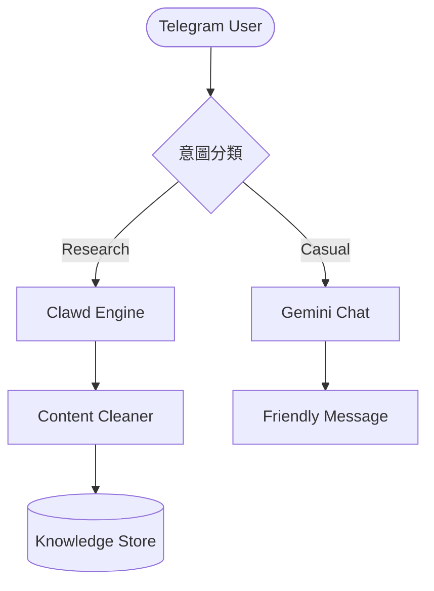

<!-- _class: lead -->
<!-- _backgroundImage: url('./images/practice_hero.png') -->
<!-- _color: white -->
<!-- _header: '' -->
<!-- _footer: '' -->

# AI Agent 實戰系列
### 從「核心思考」到「全自動化研發」的統帥之路

**講師：paddyyang**
*2026 AI 技術工作坊*

---

# AI Agent 實戰系列 (0)
## 開發新思維：從「寫程式」到「下指令」

> **「最好的開發工具不是軟體，而是您那顆清晰且具邏輯的大腦。」**

---

## 🚀 Module 1: 核心觀念的典範轉移
#### 讓 AI 成為您的數位架構師

<div class="columns">
<div class="card">

### 傳統開發 (Coding)
人類思考邏輯 -> 寫代碼 (Python/JS) -> 解決 Bug -> 完成。
</div>

<div class="card">

### AI CLI 開發 (Agentic)
人類定義「需求」與「邊界」 -> **指揮 AI** -> AI 自主寫碼、測試、修復 -> 交付成果。
</div>
</div>

**重點：您不再需要親自動手寫 Code，您需要的是清楚的「規格」與「邏輯」。**

---

## 🏗️ Module 2: AI Agent 的三大核心支柱
#### 在 `.agent` 目錄中的智慧結構

1.  **腦 - 強制約束 (Rules)**：定義 Agent 「不能做什麼」的護欄文件。
    *   *對應：* `.agent/rules/`
2.  **手 - 原子能力 (Skills & Workflows)**：執行任務的工具與 SOP。
    *   *對應：* `.agent/skills/` 與 `.agent/workflows/`
3.  **心 - 背景與記憶 (Context)**：專案設計與進度的持久化記憶。
    *   *對應：* `.agent/context/`

---

## 🦎 Module 3: 演進史 — 龍蝦的「脫殼」重生
#### 從工具升級為數位分身

- **起源 (ClawdBot)**：具備利爪的「網頁獵取者」。
- **轉折 (Moltbot)**：擺脫模型依賴，強調成長與適應。
- **蛻變 (OpenClaw)**：最終進化為支援多模型、強調 **「資料主權」** 的開放體系。

**「Your Machine, Your Keys, Your Data」**

---

# AI Agent 實戰系列 (1)
## ClawdBot 智庫助理
### 整合 Google Antigravity + Gemini + SQLite

---

## 🎯 Module 1: 核心願景與目標
#### 打造懂你且擁有「外部眼界」的數位第二大腦

- **主動獵取**：自動將 URL 轉化為乾淨的 Markdown 格式。
- **長效記憶**：利用 SQLite 建立本地化的個人知識庫。
- **智慧過濾**：自動區分「深度研究」與「日常閒聊」。

---

## 📐 Module 2: 系統架構圖 (System Design)



---

## 💾 Module 3: 數據結構與記憶保險箱
#### RAG (Retrieval-Augmented Generation) 的個人實踐

- **SQLite 角色**：輕量、本地、支持持久化。
- **關鍵 Table 設計**：
    *   **`raw_crawls`**：唯一 URL 約束，避免重複工作。
    *   **`memories`**：加入 `is_star` 標記，沉澱精華。

> [!TIP]
> **技術亮點**：這不是單純的聊天機器人，這是一個具備強大地端檢索能力的知識引擎。

---

## 🛡️ Module 4: 爬蟲技術與魯棒性 (Robustness)

AI 應對複雜網路環境的能力：

1.  **偽裝技術**：處理 **403 Forbidden** (User-Agent 偽裝)。
2.  **時效控制**：實作 **超時 (Timeout)** 與自動偵測。
3.  **自動化驗證**：
    ```bash
    py clawdbot/src/crawler_skill.py "https://example.com"
    ```

---

# AI Agent 實戰系列 (2)
## 遊戲研發自動化
### 企業級自建技能庫應用

---

## 🏗️ Module 1: AI 2.0 生產力新範式
#### 為什麼傳統對話無法支撐專業研發？

- **不穩定性**：同樣的 Prompt，每次結果都不同。
- **邏輯斷層**：缺乏標準作業程序 (SOP)。

**解決方案：Agentic Skills 框架**
將專業 SOP **模組化** 與 **封裝化**。為 AI 裝上「專業外掛」，確保輸出符合工業規格。

---

## 📂 Module 2: 企業級自建 AI 技能庫
#### 打造屬於組織的「智慧資產」庫

<div class="columns">
<div class="card">

### 核心優勢
- **高度定制化**：鎖定專業語氣與格式。
- **資料隱私**：技能定義不外流。
- **快速迭代**：隨需求即時更新。
</div>

<div class="card">

### 核心分類
- `level-designer/`：關卡設計師。
- `character-creator/`：角色設計師。
- `skill-creator/`：技能建立器。
- `enterprise/`：辦公自動化。
</div>
</div>

---

## 🔗 Module 3: 實作案例 — GDD 自動生成器
#### 鏈式調用工作流 (Chain of Thought)

1.  **初始化**：從 `.agent/skills/` 讀取 `SKILL.md`。
2.  **場景設計**：啟用 `@level-designer` 生成地圖挑戰。
3.  **角色注入**：動態傳遞地圖上下文給 `@character-creator`。
4.  **邏輯校驗**：檢查 Boss 技能是否與環境共生。

---

# AI Agent 實戰系列 (3)
## 全自動化前端開發
### FastAPI + Gemini + VVibe Coding

---

## 🌐 Module 1: 數據源頭與路由 (FastAPI)
#### 定義後端數據作為生成基準

- **核心架構**：使用 `FastAPI` 建立非同步 API。
- **數據契約**：定義 Pydantic 模型，確保數據結構一致性。
- **靈活性**：支援 `?mock=true` 快速產生測試數據。

**重點：在 Vibe Coding 中，後端數據結構是前端生成的唯一基準。**

---

## 🎨 Module 2: 視覺定義與 Gen-UI
#### 將數據轉換為精確的視覺語言

1.  **結構化約束**：將 JSON Schema 提供給 AI 作為約束。
2.  **技術選型**：單一 HTML + Tailwind CSS + Chart.js。
3.  **視覺 Vibe**：明確要求配色方案、佈局邏輯與響應式規則。

---

## 🧪 Module 3: 自動化部署與 E2E 測試
#### 實現「自動生成、自動測試」的閉環

- **一鍵拉起**：透過 Antigravity 自動啟動服務。
- **無人值守驗證**：
    - 利用 `Playwright` 自動檢測渲染狀態。
    - 數據連通性測試與跨設備佈局檢查。

---

# 🏁 總結：開啟您的 AI 統帥之路

1.  **規格即能力**：說明越清楚，AI 越強大。
2.  **由繁化簡**：將大任務拆解，善用「鏈式調用」。
3.  **掌握交付物**：關注邏輯與成果，而非繁瑣的實作細節。

> **「這不是在寫程式，這是在指揮一場數位的交響樂。」**

---

<!-- _class: lead -->

# Q&A / 實戰討論
**讓我們一起打造屬於您的 AI 代理部隊**

> © 2026 paddyyang (paddyyang.igs.com.tw@gmail.com) | MIT License
