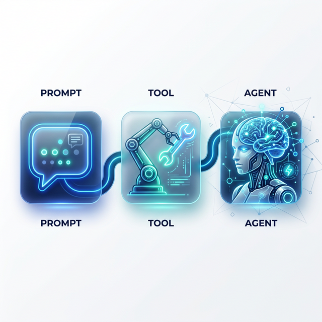
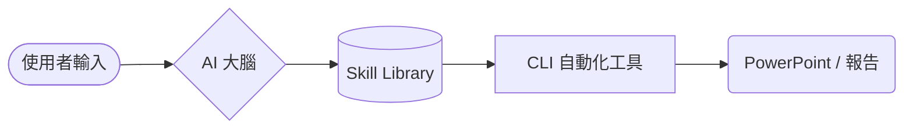

<!-- _class: lead -->
<!-- _backgroundImage: url('./images/hero.png') -->
<!-- _color: white -->
<!-- _header: '' -->
<!-- _footer: '' -->

# AI Agent Skills Workshop
### 從 Prompt 到 CLI 自動化與 Agent 工作流

**講師：paddyyang**
*2026 AI 技術工作坊*

---

## 🎯 本次工作坊目標
#### 讓你掌握從「對話」到「自動化」的核心路徑

- **掌握核心概念**：理解 AI Skill 與一般 Prompt 的差異
- **動手實作**：建立屬於自己的可重複使用技能庫
- **工具化能力**：學會使用 CLI 自動化簡報生成流程
- **架構思維**：設計簡單且高效的 AI Agent 工作流 (Workflow)

---

## 🚀 AI 應用的三個演進階段
#### 從被動回覆到主動完成任務



<div class="columns">
<div class="card">

### 1. Prompt (提詞)
單純與 AI 對話，依賴單次輸入與情境。
</div>

<div class="card">

### 2. Tool (工具化)
AI 開始具備「雙手」，能操作 API、CLI 或資料庫。
</div>

<div class="card">

### 3. Agent (代理人)
具備自主規劃、決策與自我修正能力的系統。
</div>
</div>

---

## ⚠️ 單純 Prompt 的侷限性
#### 為什麼我們需要「技能化 (Skill-ized)」？

> [!CAUTION]
> **碎片化 (Fragmentation)**: 無法在不同專案間輕鬆共享。
> **不可控 (Inherit Risk)**: 輸出格式隨機，難以被程式解析。
> **低效率 (Low Reuse)**: 每次都要重複寫背景與規則。

---

## 💡 什麼是 AI Skill？
#### 定義：可重複使用的「智能模組」

AI Skill = **[ Role + Context + Task + Rules + Constraints ]**

- **封裝性**：將複雜流程打包成一個簡單指令
- **標準化**：統一輸出 JSON 或 Markdown 等機器可讀格式
- **組合性**：可以像樂高一樣被 Agent 呼叫

---

## 🏗️ AI Skill 的標準結構
#### 專業技能的組成元素

```markdown
# SKILL.md
- **Role**: 資深行銷專家
- **Context**: 針對 2026 春季新品發布
- **Task**: 生成 5 個社群媒體文案標題
- **Rules**: 使用繁體中文，語氣親切，包含 Emoji
- **Output**: JSON 格式，含 Title 與 Hashtags
```

---

## 📚 建立你的技能庫 (Skill Library)
#### 讓 AI 具備橫向擴散的能力

<div class="columns">
<div>

- `skills/email-writer`
- `skills/report-generator`
- `skills/code-reviewer`
- `skills/slide-designer`

</div>
<div class="card">

### 優勢
1. **一致性**：跨團隊輸出風格統一
2. **可維護性**：改一行規則，所有 Agent 同步更新
3. **可測試性**：針對單一技能進行品質優化

</div>
</div>

---

## 🛠️ Skill → CLI Automation
#### 當技能遇上命令列工具

AI Skill 提供「腦力」，CLI 提供「體力」。

```bash
# 範例：將 Markdown 轉化為專業 PPT
python main.py generate --input draft.md --output final.pptx
```

- **批次處理**：一次產出 100 份報告
- **系統整合**：與 CI/CD 或定時任務結合
- **無縫接軌**：直接產出 Office/PDF 等正式格式

---

## 📐 本課程 Demo 架構
#### AI Agent Skills 的運行邏輯



---

## 📂 專案結構範例
#### 標準化的 Agent 技能專案結構

```bash
ai-agent-workshop/
├── ai_cli/        # 核心自動化邏輯 (Python)
├── skills/        # 所有的 AI 技能定義 (*.md)
│   └── ppt-gen/   # 簡報生成專門技能
├── examples/      # 範例輸入素材
└── outputs/       # AI 產出的最終成品
```

---

## 📝 簡報定義格式 (Markdown v2)
#### 用最簡單的格式，做最美的事情

```markdown
# 這是頁面標題

- 這是第一個重點
- 這是第二個重點
- 這是第三個重點

<!-- 視覺建議：加入一張示意圖 -->
```

**為什麼用 Markdown？**
- 易於版本控制 (Git)
- AI 生成效率最高
- 結構清晰，不被樣式干擾

---

## ⚡ 實戰示範：AI 生成流程
#### 從主題到投影片，僅需一個指令

<div class="card">

### 操作步驟
1. **輸入主題**：`"AI 在行銷領域的創新應用"`
2. **AI 規劃**：根據 `ppt-gen` 技能生成大綱
3. **CLI 轉換**：自動解析 Markdown 並套用佈局
4. **輸出成品**：在 `outputs/` 資料夾查看成果

</div>

---

## 🛠️ Step-by-Step CLI 指令

```bash
# 1. 啟動 AI 大腦生成大綱
python main.py ai "Marketing Innovation"

# 2. 手動微調 (選配)
code examples/output_draft.md

# 3. 正式產出 PPTX
python main.py generate examples/output_draft.md
```

---

## 🧠 設計高品質 Skill 的秘訣
#### 高級提詞工程 (Prompt Engineering)

1. **定義邊界**：明確告訴 AI 「什麼不要做」
2. **一頁一重點**：確保每張投影片訊息密度適中
3. **少即是多**：避免過多文字，強調「視覺導向」
4. **範例引導 (Few-shot)**：提供一份理想的範本供 AI 模擬

---

## 🤖 Agent Workflow 深度解析
#### 什麼才是真正的「代理人」？

<div class="columns">
<div class="card">

### 傳統腳本
輸入 A → 產出 B (固定邏輯)
</div>

<div class="card">

### AI Agent
輸入需求 → **思考規劃** → **選取技能** → **執行工具** → **自我檢查** → 產出結果
</div>
</div>

---

## 🏢 企業級應用場景
#### AI Skill 解決了什麼問題？

- **自動週報**：讀取 Jira/Git 直接生成主管簡報
- **合約審核**：讀取 PDF，根據法規 Skill 自動標註風險
- **客戶服務**：根據產品手冊 Skill 即時回覆多國語言
- **數據分析**：讀取 CSV，自動生成趨勢分析與視覺化

---

## ✍️ 實作練習：打造你的第一個 Skill
#### 練習題目：AI 行銷大師

> [!TIP]
> **任務**：請在 `skills/` 下建立一個 `marketing-pro` 資料夾。
> **內容**：撰寫 `SKILL.md`，讓 AI 能根據產品名稱，產出 3 張「痛點分析」投影片大綱。

---

## 🏁 結語：從 AI 工具人到 AI 建築師
#### 掌握核心，主導自動化浪潮

- **Prompt** 是溝通的起點
- **Skill** 是能力的封裝
- **Tool** 是身體的延伸
- **Workflow** 是靈魂的佈排

**現在，開始建立你的第一項 AI Skill 吧！**

---

<!-- _class: lead -->

# Q&A / 實作交流
#### 讓我們一起把想法變成自動化工具

> © 2026 paddyyang (paddyyang.igs.com.tw@gmail.com) | MIT License
